[README.md](https://github.com/user-attachments/files/30998989/README.md)

<table>
<tr>

<td width="45%" align="center" valign="middle">

<pre>

                                 :-====++++===-:
                               :#%%%@@@@@%%%%%%%###*+-:
                               =###%%%%%##########%%%@@*
                               :*################**####@-
                               -*####%%%%%%%%#######%%#%+
                              =#####*++**#%%%%%%%%%%%%%%+
                             #%##*+:..     .-+**##*++++*+
                      .:+:  =%##+=-----:.    -++=:     ..
                      -+*==.#%##*=:     -  ..+##:   .::==:.
                      +#::*+%#%%%%##+=-::-=+*#%%+.  :: -+-:..
                      -#+#++###%%%%%%%######%%%%%*+==*##*=-:.
                       %%%+-*######%%%%%#*+#*###%##%%%%%*=-:.
                        +=.-+*#####%%###**+:..-=-=*#%%%%*=-:.
                           -=***######*=--:      +*###%#+=-:.
                           -:=*++****+       ::    -*##+=-:.
                           #:.-====++-:=+==----=-:  **+-:..
                          :%#:  ::---+###*-    :*#+==-:..
                          :%##=.   .:=*#####++*###-....
                      .    =%##+-.     ..--====-::
                   ...      =%#**=-:.
                ...          -%##*==-::::::::-+#
             ..::.            :###**+==-===+*#%-  ..
         .......               :*******+++***##:   :.  ..
     ..:::...                   -#***********##+.:  ::.  ....
  .::::....                      +%##**#######%#-#-  ::.    ..::.
........                          +@%%%%#####%%##%%-  :.       ::
                                   +%%%%%%%%%%%%%%%%.  :        .
                                    +%%%%%%%%%%%%%%%#  .:   .    .
                                     *%%%%%%%%%%%%%%%*  .:       .

</pre>

</td>

<td width="55%" valign="middle">

<pre>
dhafer@github
────────────────────────────────────────

OS: ............ macOS / Linux
Host: .......... Iraq
Role: .......... Software Developer
Status: ........ Building & Learning

Languages.Programming:
  Python, C++, JavaScript

Languages.Web:
  HTML, CSS, JavaScript, React

Frameworks:
  React, Node.js

Tools:
  Git, GitHub, Docker, VS Code

────────────────────────────────────────
Interests
────────────────────────────────────────

AI: Artificial Intelligence
Robotics:Robotics & Embedded Systems
Development: Software Engineering
Open Source: GitHub Projects

────────────────────────────────────────
Contact
────────────────────────────────────────

GitHub: ........ dhaferaljaziri
LinkedIn: ...... Dhafir AL-jazairi
Email: dhafir.mohammed543@gmail.com

────────────────────────────────────────
GitHub Stats
────────────────────────────────────────

Repositories: ......... 25
Followers: ............ 150
Stars: ................ 320
Commits: .............. 1,200
</pre>

</td>

</tr>
</table>

[README.md](https://github.com/user-attachments/files/30998996/README.md)
# Hi there, I'm Mahyudeen Shahid! 👋

<!-- Theme-Sensitive Header Banner -->
<picture>
  <source media="(prefers-color-scheme: dark)" srcset="readmefile/dark.svg">
  <source media="(prefers-color-scheme: light)" srcset="readmefile/light.svg">
  
</picture>

 

## 🚀 About Me
I’m **Mahyudeen Shahid**, a Software Engineering student and Full-Stack Web Developer who builds impactful, high-performance web applications beyond simple landing pages, focusing on immersive and interactive experiences using **GSAP, Framer Motion, Three.js, and Spline**. 

I work with **React, Next.js, MERN stack, and Supabase**, combining creative frontend development with strong backend functionality to build scalable full-stack solutions. I’m also passionate about **AI and automation**, building AI agents and workflows using tools like **n8n**, and I have experience deploying applications across Netlify, Vercel, DigitalOcean, AWS, Google Cloud, Azure, and Hostinger.

> 💡 *"Every error is a lesson and every crash is an opportunity to rebuild stronger."*

- 🎓 **Education:** B.S. in Software Engineering, Pakistan.
- 💬 **Ask me about:** Creative development, full-stack architectures, or automated AI agent workflows.
- ✉️ **Contact:** [mahyudeenjutt@gmail.com](mailto:mahyudeenjutt@gmail.com)
- 🌐 **Portfolio:** [mahyudeen.netlify.app](https://mahyudeen.netlify.app)

---

## 🛠️ Technical Skills

### 🖥️ Frontend & Creative

### ⚙️ Backend & API

### 🗄️ Databases & BaaS

### 🤖 AI & Automation

### ☁️ DevOps & Deployment

---

## 🏅 Holopin Badges

---

## 📈 GitHub Stats & Metrics

<!-- Sleek contribution activity graph with theme sensitivity -->

  <picture>
    <source media="(prefers-color-scheme: dark)" srcset="https://github-readme-activity-graph.vercel.app/graph?username=MahyudeenShahid&bg_color=030712&color=94A3B8&line=10B981&point=34D399&area_color=0D9488&area=true&hide_border=true&radius=12">
    <source media="(prefers-color-scheme: light)" srcset="https://github-readme-activity-graph.vercel.app/graph?username=MahyudeenShahid&bg_color=FFFFFF&color=475569&line=0D9488&point=10B981&area_color=E6FFFA&area=true&hide_border=true&radius=12">
    
  </picture>

<!-- Side-by-Side Stats Cards with theme sensitivity -->

  <!-- GitHub Stats Card -->
  <picture>
    <source media="(prefers-color-scheme: dark)" srcset="https://ghstats.dev/api/card?username=MahyudeenShahid&bg=030712&title_color=10B981&text=94A3B8&icon_color=34D399&border_color=0D9488">
    <source media="(prefers-color-scheme: light)" srcset="https://ghstats.dev/api/card?username=MahyudeenShahid&bg=FFFFFF&title_color=0D9488&text=475569&icon_color=10B981&border_color=E2E8F0">
    
  </picture>
  
  <!-- Top Languages Card -->
  <picture>
    <source media="(prefers-color-scheme: dark)" srcset="https://ghstats.dev/api/langs?username=MahyudeenShahid&layout=grid&bg=030712&title_color=10B981&text=94A3B8&icon_color=34D399&border_color=0D9488">
    <source media="(prefers-color-scheme: light)" srcset="https://ghstats.dev/api/langs?username=MahyudeenShahid&layout=grid&bg=FFFFFF&title_color=0D9488&text=475569&icon_color=10B981&border_color=E2E8F0">
    
  </picture>

<!-- Streak Stats with theme sensitivity -->

  <a href="https://mahyudeen.netlify.app" target="_blank">
    <picture>
      <source media="(prefers-color-scheme: dark)" srcset="https://streak-stats.demolab.com?user=MahyudeenShahid&theme=dark&background=030712&stroke=0D9488&ring=10B981&fire=34D399&currStreakNum=10B981&currStreakLabel=94A3B8&sideNums=94A3B8&sideLabels=94A3B8&dates=6B7280">
      <source media="(prefers-color-scheme: light)" srcset="https://streak-stats.demolab.com?user=MahyudeenShahid&theme=light&background=FFFFFF&stroke=E2E8F0&ring=0D9488&fire=10B981&currStreakNum=0D9488&currStreakLabel=475569&sideNums=475569&sideLabels=475569&dates=94A3B8">
      
    </picture>
  </a>

---

  ⭐ <b>If you like this profile README, please consider leaving a star to show your support!</b> ⭐

---

  Designed, thought, and developed with 💚 by <a href="https://mahyudeen.netlify.app/" target="_blank"><b>Mahyudeen Shahid</b></a> 
  Every line of code crafted for immersive and interactive digital experiences.

